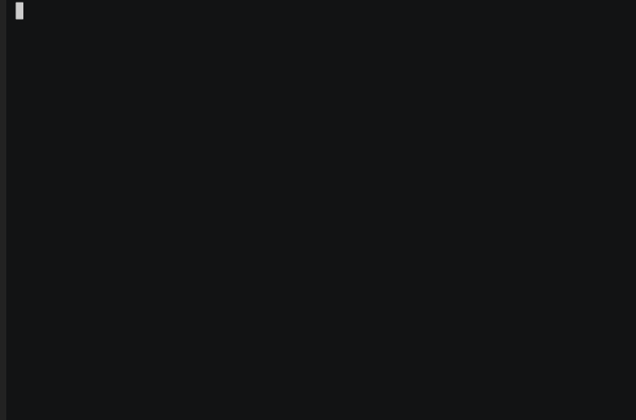

<div align="center">

# Gradio Chatbot

> 一个可以将 [Huggingface Spaces](https://huggingface.co/spaces)、[魔搭创空间](https://www.modelscope.cn/studios) 及 Gradio ChatBot 自动转成免费 API 的 Npm 包。理论上支持所有带 chatbot 的空间，目前完美支持了 [GPT4Free，ChatGPT，Llama 2，Vicuna，MPT-30B，Falcon，ChatGLM，通义千问](#模型列表) 等众多模型空间。

[](https://www.npmjs.com/package/gradio-chatbot)
[](https://github.com/weaigc/gradio-chatbot/blob/main/license)

</div>

> 由于目前 Huggingface 上的 [ChatGPT](https://huggingface.co/spaces/yuntian-deng/ChatGPT) 空间压力过大，导致调用延时明显变长。如果你有自己的 ChatGPT 账号，推荐使用 [gpt-web](https://github.com/weaigc/gpt-web)。

- [快速上手](#快速上手)
  - [NPM](#npm)
  - [Docker](#docker)
- [安装](#安装)
- [使用](#使用)
  - [CLI模式](#CLI模式)
  - [API接口](#API接口)
  - [API函数](#API函数)
- [模型列表](#模型列表)
- [兼容性](#兼容性)
- [更新日志](#更新日志)
- [鸣谢](#鸣谢)
- [License](#license)

## 快速上手

### NPM

* 体验 ChatGPT

```bash
npx gradio-chatbot
# or
npm install -g gradio-chatbot
chatbot
```

* 体验 Llama2
```
chatbot 2
# 或者
chatbot https://huggingface.co/spaces/huggingface-projects/llama-2-13b-chat
```

> 更多用法请输入 chatbot help


### Docker
```
docker build . -t gradio-server
docker run --rm -it -p 8000:8000 gradio-server
```

[](https://asciinema.org/a/0ki5smP795eyXdXGlx53UDmTB)


## 安装

你可以使用 npm 或者 yarn 来安装 gradio-chatbot，Node 版本需要 >= 18。

```bash
npm install gradio-chatbot
# or
yarn add gradio-chatbot
```

## 使用
目前支持三种模式。

### CLI模式
参考 [快速上手](#快速上手)。

### API服务
为了方便使用，提供了两种形式的接口。
 * 流式输出，直接访问 http://localhost:8000/api/conversation?model=0&text=hello 即可。
 * 非流式输出，调用方式同 ChatGPT API。以下为调用示例。

```
curl http://127.0.0.1:8000/api/conversation \
  -H "Content-Type: application/json" \
  -d '{
     "model": "gpt-3.5-turbo",
     "messages": [{"role": "user", "content": "hello"}],
   }'
```

### API函数
```ts
import { GradioChatBot } from 'gradio-chatbot'

const bot = new GradioChatBot();

async function start() {
  const message = await bot.chat('hello', {
    onMessage(partialMsg) {
      console.log('stream output:', partialMsg);
    }
  });
  console.log('message', message);
}

start();
```

你也可以把你想要转换的空间地址输入进去，如 https://huggingface.co/spaces/h2oai/h2ogpt-chatbot
```ts
import { GradioChatBot } from 'gradio-chatbot'

const bot = new GradioChatBot({
  url: 'https://huggingface.co/spaces/h2oai/h2ogpt-chatbot',
  fnIndex: 35,
}); // 调用自定义 ChatBot 模型

async function start() {
  console.log(await bot.chat('Hello'));
}

start();
```

除此之外，Npm 包里面已经内置了 10 个流行的 [Huggingface Spaces](https://huggingface.co/spaces)、[魔搭创空间](https://www.modelscope.cn/studios)，你可以直接[传入模型序号使用](#模型列表)。
```ts
import { GradioChatBot } from 'gradio-chatbot';

const bot = new GradioChatBot('1'); // 使用内置1号模型
async function start() {
  console.log(await bot.chat('Tell me about ravens.'));
}

start();
```

更多示例请前往目录: [Examples](./examples/)

> 注意：Huggingface 上的部分模型可能会收集你输入的信息，如果你对数据安全有要求，建议不要使用，使用自己搭建的模型是一个更好的选择。

## API文档

参见 [API 文档](./API_CN.md)

## 模型列表

调用序号 | 类型 | 说明 | 模型
-----|-----|------|-------
0 | Huggingface Spaces | GPT Free | https://huggingface.co/spaces/justest/gpt4free
1 | Huggingface Spaces | ChatGPT | https://huggingface.co/spaces/yuntian-deng/ChatGPT
2 | Huggingface Spaces | Llama2 Spaces | https://huggingface.co/spaces/ysharma/Explore_llamav2_with_TGI
3 | Huggingface Spaces | MosaicML MPT-30B-Chat | https://huggingface.co/spaces/mosaicml/mpt-30b-chat
4 | Huggingface Spaces | Falcon Chat | https://huggingface.co/spaces/HuggingFaceH4/falcon-chat
5 | Huggingface Spaces | Star Chat | https://huggingface.co/spaces/HuggingFaceH4/starchat-playground
6 | Huggingface Spaces | ChatGLM2 | https://huggingface.co/spaces/mikeee/chatglm2-6b-4bit
7 | Huggingface Spaces | ChatGLM | https://huggingface.co/spaces/multimodalart/ChatGLM-6B
8 | Huggingface Spaces | Vicuna 13b (此模型国内不可访问，请配置代理后使用) | https://chat.lmsys.org/
9 | Huggingface Spaces | 姜子牙 V1 模型 | https://huggingface.co/spaces/IDEA-CCNL/Ziya-v1
10 | 魔搭 | 通义千问 | https://modelscope.cn/studios/qwen/Qwen-7B-Chat-Demo/summary
11 | 魔搭 | ChatGLM2 | https://modelscope.cn/studios/AI-ModelScope/ChatGLM6B-unofficial/summary
12 | 魔搭 | 姜子牙V1.1 | https://modelscope.cn/studios/Fengshenbang/Ziya_LLaMA_13B_v1_online/summary
13 | 魔搭 | 达魔院出品的角色对话机器人 | https://modelscope.cn/studios/damo/role_play_chat/summary

> 国内访问推荐使用魔搭社区提供的模型，访问速度更快更稳定。
> 更多好用模型欢迎在 [issue](https://github.com/weaigc/gradio-chatbot/issues) 区提交贡献。


## 兼容性

- 此 Npm 包需要 `node >= 18`.

## 更新日志
查看 [CHANGELOG.md](./CHANGELOG.md)

## 鸣谢

- Huge thanks to [@gradio/client](https://github.com/gradio-app/gradio/tree/main/client/js)
- [OpenAI](https://openai.com) for creating [ChatGPT](https://openai.com/blog/chatgpt/) 🔥


## License

Apache 2.0 © [LICENSE](https://github.com/weaigc/gradio-chatbot/blob/main/LICENSE).
